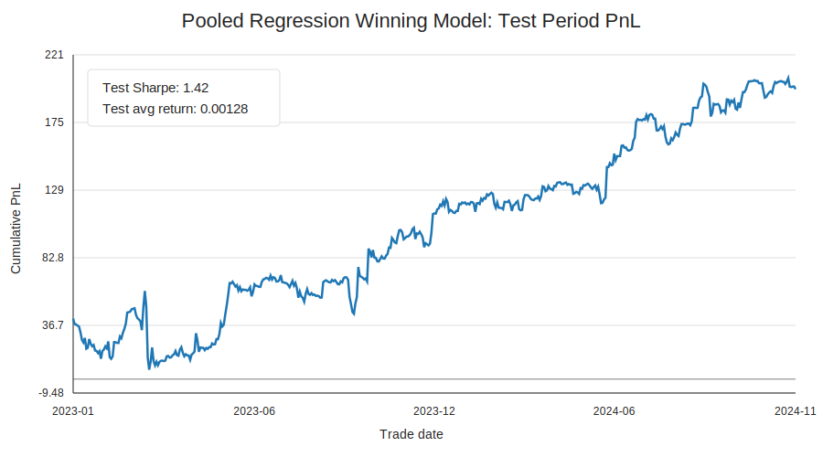

# Regime-Based Trading Model Research

Research notebooks for comparing regime-aware return prediction models in a low
signal-to-noise financial forecasting setting. The central modeling question is
whether regime variables should be treated differently from the direct predictive
features.

- Base linear model
- Mixture-of-experts model
- Partial-pooling regime ridge model
- Transformer model
- XGBoost model

The `notebooks/eda.ipynb` notebook organizes the original exploratory checks
used before the modeling notebooks.

Each implemented idea is illustrated in the `notebooks/` folder. The clear
winner is the pooled regression model, which shows good validation and test
performance.

The main empirical takeaway is that simple, strongly regularized models are often
competitive in this setting. I also tested transformer and XGBoost models, but
with structural assumptions that separate feature variables from regime variables
instead of treating every input column as interchangeable.

The raw dataset is not included. To reproduce the notebooks, place the input parquet file at:

```text
data/model_data.parquet
```

Expected columns:

- `trade_date`: timestamp or date-like column
- `ret_fopen`: target return column
- `x*`: feature columns used as direct return-prediction signals
- `cond*`: regime/conditioning columns used to change how feature signals are interpreted

## EDA Observations

The EDA notebook shows that the regime variables (`cond1`, `cond2`, and
`cond3`) do not have stable distributions across the full sample. In particular,
their distributions differ between the first and second half of the data. This
kind of regime-variable shift can make flexible non-linear models harder to
train and validate reliably, because later validation or test periods may not
look like the earlier training period.

As one example, the distribution of `cond3` shifts between the first and second
half of the sample:


The feature variables also show high autocorrelation. As a result, the effective
sample size is smaller than the raw row count suggests. Combined with noisy
returns and shifting regime variables, this motivated longer training periods
for the more complex transformer and XGBoost experiments.

## Data

The notebooks use a walk-forward protocol: preprocessing parameters are estimated
on each training window and then applied to the held-out window.

- Missing regime values: `cond2` and `cond3` are forward-filled for any leading missing rows.
- Missing modeling rows: training rows with missing feature, regime, or target
  values are dropped; prediction rows with missing feature/regime values are
  dropped.
- Features are already normalized, so no extra normalization is applied.
- Feature outliers: `x*` features are clipped to `[-3, 3]`.
- Training target outliers: `ret_fopen` is winsorized only inside the training
  window used to fit the model, using the 1st and 99th percentiles. This is used
  to reduce the influence of extreme target observations during estimation.
- Target volatility scaling: `ret_fopen` is not volatility-scaled. I assume the
  strategy trades the same gross amount regardless of recent volatility, and the
  PnL computation uses raw realized returns with clipped predictions as position
  sizes. This keeps the modeling target aligned with the backtest objective, but
  it also makes the prediction problem harder because the target scale is less
  stable across time.
- Regime variables: `cond*` variables are winsorized on the training window using
  the 1st and 99th percentiles, standardized using training-window mean/std, and
  finally clipped to `[-5, 5]`.
- Backtest returns: realized `ret_fopen` values are not clipped or winsorized in
  the backtest.
- Backtest signal: predictions are clipped to `[-3, 3]` before computing daily
  PnL and Sharpe, so clipping applies to position sizing rather than realized
  returns.

## Modeling Assumption

The dataset is treated as a low signal-to-noise problem, so the baseline emphasis
is on regularized linear structure and stable walk-forward validation rather than
large unconstrained models.

When designing the models in this high-noise setting, I aim to build models with the following structural assumptions:

- feature variables carry the direct return-prediction signal;
- regime variables affect how those feature signals should be pooled,
  gated, split, or attended to.

So, I incorporate my prior in the model building.

## Model Summaries

### Base Linear Model

The base model is a regularized linear return predictor using the `x*` feature
columns directly. It is intentionally simple: the goal is to establish a stable
walk-forward baseline in a low signal-to-noise setting before adding regime
structure. The goal is to provide a simple baseline to compare with the other models.


### Partial-Pooling Regime Ridge

The pooled model is better described as a partial-pooling regime ridge model. It
is not a simple average of models. For a chosen regime variable, the training
data is split into quantile buckets using training-window quantiles. The model
then fits:

```text
prediction = x * beta_shared + x * delta_regime_bucket
```

`beta_shared` is the global linear signal shared across all observations.
`delta_regime_bucket` is the regime-specific adjustment. Both pieces are ridge
regularized, with separate penalties for the shared component and the
regime-specific deviations. This gives a compromise between one global linear
model and fully separate models per regime bucket.

### Mixture Of Experts

The mixture-of-experts model keeps the experts simple, usually ridge-style linear
predictors, but lets the regime variables determine how much weight each expert
gets. Conceptually:

```text
prediction = sum_k gate_k(regime) * expert_k(features)
```

This is a softer version of regime splitting. Instead of assigning each row to a
single hard regime bucket, the model learns regime-dependent weights over
multiple feature-based experts.

### Directed-Regime Transformer

The transformer notebook tests architectures that explicitly separate feature
tokens from regime tokens. The selected structure is a directed-regime attention
model:

```text
feature tokens -> feature self-attention
regime tokens  -> regime self-attention
regime tokens  -> feature tokens through one-way cross-attention
feature tokens -> prediction head
```

The key prior is that features are the direct prediction variables, while regimes
modify how feature signals interact. Regime tokens are not read out directly by
the final head; they influence the feature representation first.

### Interaction-Constrained XGBoost

The XGBoost notebook uses gradient-boosted trees, but with interaction
constraints that encode the same feature/regime distinction. Each `x*` feature
is allowed to interact with the `cond*` regime variables, but `x*` features are
restricted from freely interacting with other `x*` features. This makes each tree
more like a regime-conditioned feature model rather than an unconstrained
high-order feature interaction search.

## Winning Model Test Performance

The best-performing model is the `cond3` partial-pooling regime ridge model. The
validation-period Sharpe is about `1.22` on 2021-2022, and the test-period
Sharpe is about `1.42` on 2023-2024. The test-period cumulative PnL is strong
and broadly consistent with the validation-period behavior.



I evaluate test performance primarily with cumulative PnL and annualized daily
Sharpe. Average return alone is not enough to validate the model. A more
comprehensive robustness review should also include performance by regime,
rank-IC analysis, time-of-day analysis, drawdown behavior, and stability across
subperiods.

## Train, Validation, And Test Split

I use two different training/validation/test protocols:

- one for the linear, partial-pooling regime ridge, and mixture-of-experts
  models; and
- one for the transformer and XGBoost models.

For the linear, partial-pooling regime ridge, and mixture-of-experts notebooks,
evaluation is walk-forward by calendar year. With the default expanding-window
setup, the model starts after at least four training years are available. For
each prediction year, it trains on all earlier eligible years, predicts the next
year, then expands the training set to include that year before moving forward.
This gives out-of-sample yearly predictions while preserving time order.

For the transformer and XGBoost notebooks, the main model-selection protocol is a
fixed split:

- Training period: all rows through `2021-12-31`.
- Outer validation period: `2022-01-01` through `2023-06-30`.
- Inner validation: a chronological tail slice from the training period, used
  for early stopping and learning-curve diagnostics.
- Test period: starts on `2023-07-01`.

Because the data is noisy, the effective sample size is reduced by feature
autocorrelation, and the regime-variable distributions shift over time, I use a
longer training period for the more complex transformer and XGBoost models.

After selecting the model/hyperparameters on the outer validation period, the
final test run retrains the selected configuration through `2023-06-30` and then
predicts rows from `2023-07-01` onward. Thus validation data is allowed into the
final training set only after model selection is complete; test rows remain held
out.

For Modal-backed notebooks, upload the local data file once:

```bash
python modal_train.py upload
modal deploy modal_train.py
```

Then run the notebooks from the `notebooks/` directory.
