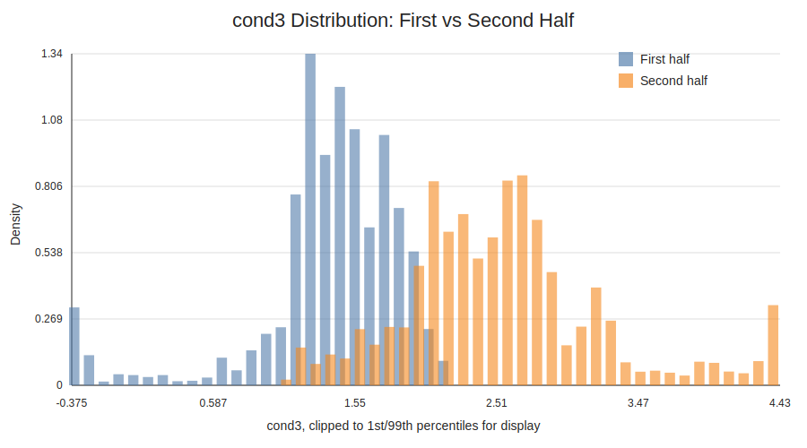
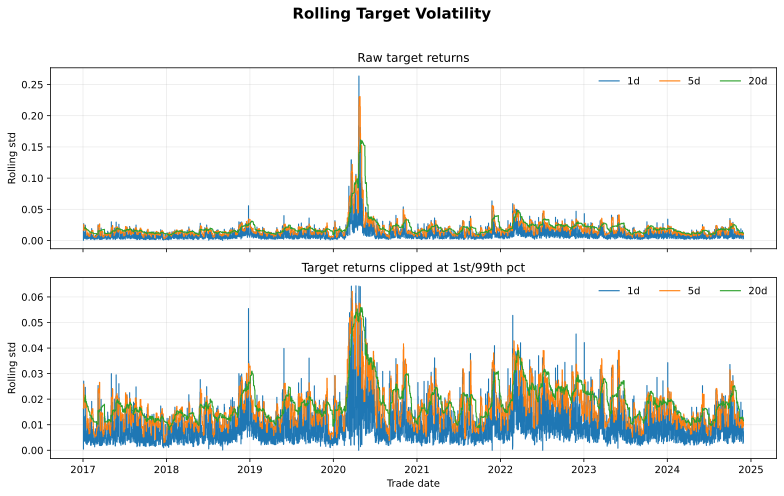
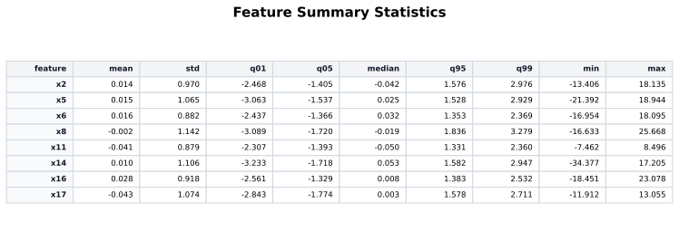
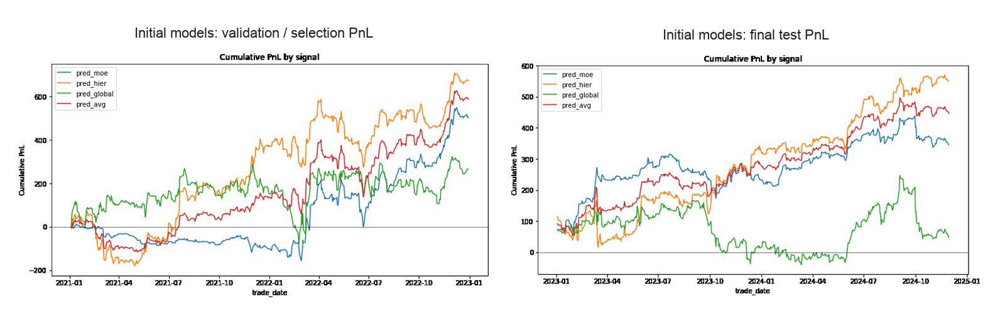
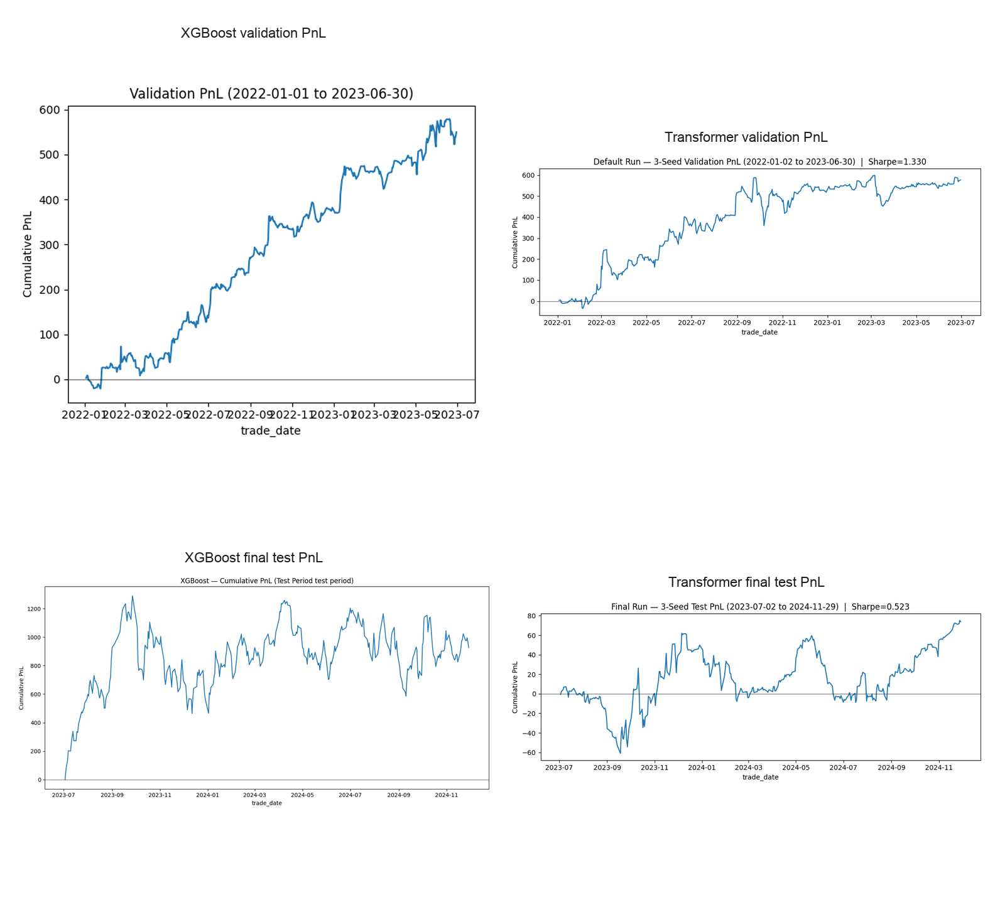

# Regime-Aware Futures Return Modeling

This repository presents a research workflow for predicting intraday futures
returns from a minute-level dataset for a single asset type. The project is framed as a
low signal-to-noise forecasting problem: returns are noisy, the target volatility
changes through time, and the regime variables shift across the sample.

The main modeling idea is simple:

- `x*` columns are treated as direct return-prediction signals.
- `cond*` columns are treated as regime variables that change how the feature
  signals should be pooled, gated, split, or attended to.

I started with three interpretable regime-aware models, then added nonlinear
tree and transformer experiments. The strongest and most stable result came
from pooling based ridge model, while the more flexible models showed
strong validation performance but weaker final test behavior.

## Problem And Modeling Thesis

The task is to predict intraday futures returns from a fixed set of feature and
conditioning variables. No raw data is committed to this repository.
To reproduce the notebooks locally, place the input parquet file at:

```text
data/model_data.parquet
```

Expected columns:

- `msgStamp`: timestamp column used for chronological ordering.
- `trade_date`: trading date used to aggregate daily PnL.
- `ret_fopen`: target return column - raw forward return.
- `x*`: feature columns used as direct return-prediction signals.
- `cond*`: conditioning/regime columns used to alter model behavior.

The key modeling choice is to avoid treating all columns as interchangeable.
Instead, the models encode the hypothesis that features predict returns, while
regime variables change the usefulness or combination of those feature signals.
This structure matters because flexible models can easily overfit noisy returns
when they are allowed to search arbitrary interactions.

## Data And EDA Findings

The dataset contains minute-level observations, but the effective sample size is
smaller than the row count suggests because the features are slow-moving and
highly autocorrelated. The target return scale also changes over time, which
makes model selection more fragile.

The regime variables are not distributionally stable. For example, `cond3`
changes visibly between the first and second half of the sample:



The rolling target-volatility check shows why the training objective needs to be
robust to large target observations:



The feature columns are roughly centered and scaled, but their tails still
matter for clipping and regularization:



These observations motivated a conservative workflow: walk-forward validation,
strong regularization, and model structures that keep a clear separation between
return features and regime variables.

## Preprocessing And Backtest Protocol

The notebooks use time-aware preprocessing. Parameters are estimated on the
training window and then applied to the held-out window.

- Missing regime values: `cond2` and `cond3` are forward-filled, then
  backward-filled only for any leading missing rows.
- Missing modeling rows: training rows with missing feature, regime, or target
  values are dropped; prediction rows with missing feature or regime values are
  dropped.
- Feature outliers: `x*` features are clipped to `[-3, 3]`.
- Training target outliers: `ret_fopen` is winsorized inside each training
  window at the 1st and 99th percentiles.
- Regime variables: `cond*` variables are winsorized on the training window,
  standardized using training-window mean/std, and clipped to `[-5, 5]`.
- Backtest returns: realized `ret_fopen` values are not clipped or winsorized.
- Backtest signal: predictions are clipped to `[-3, 3]` before daily PnL and
  Sharpe are computed.

Transaction costs are ignored. The features have low autocorrelations and so slow changing.
Hence, transaction costs can be lower for a linear model.

## Model Progression

### 1. Initial Regime Models

The first research pass focused on interpretable, regularized models:

- **Global linear ridge:** a simple baseline using only `x*` features as direct
  predictors. It ignores the regime effect and serves a baseline helping us
  understand the contribution of the regime.
- **Partial-pooling regime ridge:** This model separates each regime variable into 3 quantiles 
  using rolling distribution and then build a separate Ridge regression model for each quantile.
  For simplicity, we do not consider the interaction effects between the regime variable and build
  a different model for each feature. Similarly, we use only 3 quantiles (most intuitive number of quantiles)
  for simplicity but different number of quantiles can be tested.

  Another alternative way of deciding on the regimes could be doing a clustring like K-keans or hierarchical.
  Also, we could decide on the regime by setting a theshold on the z-score like mean+/- k*std. That can be also
  tested. This kind of thresholding can result in more meaningful groups but the groups could be sparse and would
  have unequal size.
- **Mixture of experts:** Several ridge-style feature experts are combined using
  regime-dependent gating weights. The regime is determined by a logistic regression model
  (gating model) and each regime's (expert's) predictive model a Ridge regresssion model.
  The model is trained by EM algorithm in a way gating model and expert models are fitted
  iteratively. This model is more flexible compared the partial pooling model but it
  is harder to train with more hyperparameters. That flexibility is at the cost of overfitting
  which is often the issue with the more complex models when it comes to the financial data -
  especially with the lower coverage and short history.

The partial-pooling model is the most important result in the project. It is
more expressive than one global linear model, but it avoids the instability of
fully separate models per regime.



| Model | Selection period | Sharpe | Average return | Final test Sharpe | Notes |
|---|---:|---:|---:|---:|---|
| Global linear ridge | through 2022 | 0.45 | 0.00047 | 0.13 | Stable baseline, weak standalone signal |
| Mixture of experts | through 2022 | 1.19 | 0.00152 | 1.31 | Stronger regime adaptation, less interpretable |
| Partial-pooling regime ridge (`cond3`) | through 2022 | 1.22 | 0.00118 | 1.42 | Best stability and strongest final test result |

In the initial-model plot, `pred_hier` is the partial-pooling regime ridge
signal and `pred_avg` is a simple average of MoE and partial-pooling signals.

### 2. Later Nonlinear Models

I also explore transformers and tree models as non-linear model alternative. 
For these models, I make a distinction between features and regime variables
in model desgin and do not treat them in the same way.

- **Interaction-constrained XGBoost:** each `x*` feature can interact with the
  `cond*` regime variables, but `x*` features are restricted from freely
  interacting with each other. This makes the tree model behave like a
  regime-conditioned feature model instead of an unconstrained interaction
  search.
- **Directed-regime transformer:** feature tokens and regime tokens are modeled
  in separate streams. Regime tokens can influence feature tokens through
  one-way cross-attention, but the prediction head reads out feature tokens only. The idea here is
  to have the regime variables in the attention mechanism but define them in a different way
  than the features. Note that it is natural to use autoregressive features in tranformers but I
  do not use autoregressive features to make the comparison equal footing. There are different ways
  of designing transfomers. I pick the following design because I want to use attention mechanism to figure
  out the non-linear relationships between features and regime variables.

```text
feature tokens -> feature self-attention
regime tokens  -> regime self-attention
regime tokens  -> feature tokens through one-way cross-attention
feature tokens -> prediction head
```



| Model | Validation period | Validation Sharpe | Validation return | Test Sharpe | Test return | Takeaway |
|---|---:|---:|---:|---:|---:|---|
| Interaction-constrained XGBoost | 2022-01-01 to 2023-06-30 | 2.25 | 0.00343 | 0.69 | 0.00062 | Very strong validation, weaker final test |
| Directed-regime transformer, 3-seed ensemble | 2022-01-02 to 2023-06-30 | 1.33 | 0.00210 | 0.52 | 0.00047 | Directionally useful, sensitive to split and seed |

## Main Takeaways

The most useful result is not just that one model won. The stronger lesson is
that structural assumptions mattered more than model complexity.

- Simple regularized models were competitive because the return target is noisy
  and the features are autocorrelated.
- Regime variables were useful, but mainly as conditioning variables rather than
  direct return predictors.
- The flexible models found validation signal, but their final test results were
  less stable than the partial-pooling ridge model.
- The best-performing model was the `cond3` partial-pooling regime ridge, with a
  validation Sharpe around `1.22` and a final test Sharpe around `1.42`.

The next research steps would be robustness checks by regime, rank-IC analysis,
time-of-day analysis, drawdown review, transaction-cost sensitivity, and
subperiod stability.

## Modal-Backed Notebooks

Some experiments are configured to run with Modal. Upload the local data file
once and deploy the helper:

```bash
python modal_train.py upload
modal deploy modal_train.py
```

Then run the notebooks from the `notebooks/` directory.
